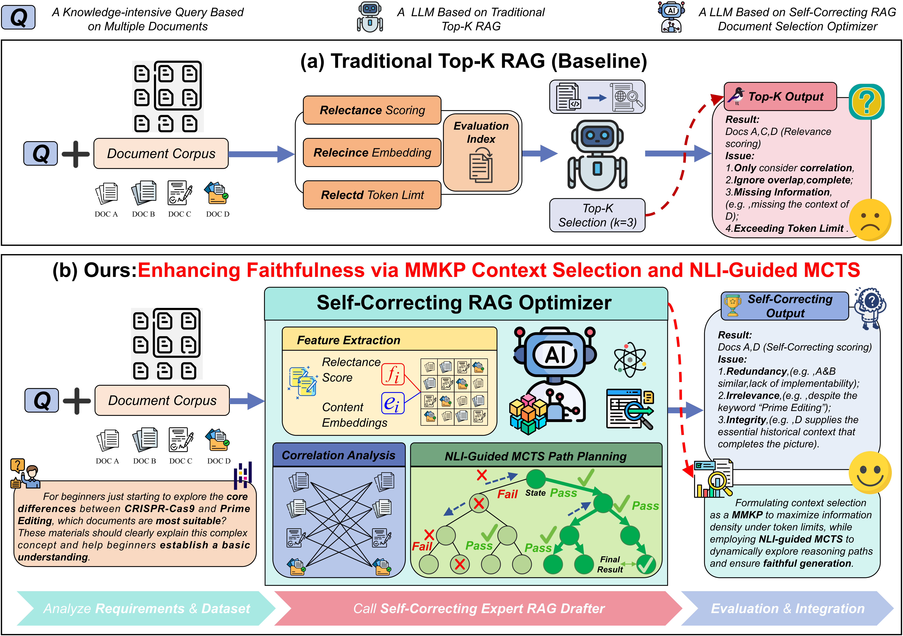
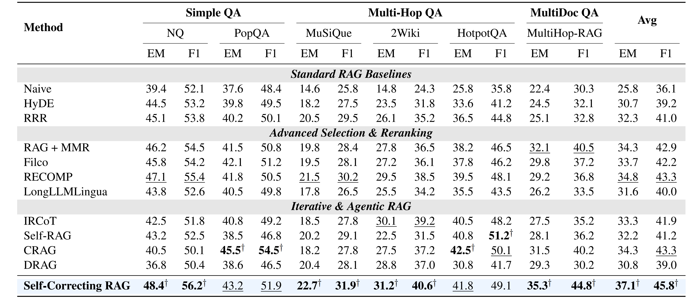

<div align="center">

# Self-Correcting RAG: Enhancing Faithfulness via MMKP Context Selection and NLI-Guided MCTS

[Code](./src) · [Configs](./configs) · [Scripts](./scripts)

</div>

## 📌 Table of Contents
- [🌟 Introduction](#-introduction)
- [🛠️ Installation](#️-installation)
- [🚀 Quick Start](#-quick-start)
- [📦 Dataset](#-dataset)
- [🔁 Reproducing our Experiments](#-reproducing-our-experiments)
- [🧭 Usage Instructions](#-usage-instructions)
- [🙏 Acknowledgments](#-acknowledgments)
- [📝 License](#-license)

---

## 🌟 Introduction

This repository implements the core methods from the paper **Self-Correcting RAG**, aiming to address two key issues in complex reasoning tasks:

1) **Low context utilization** (Top-k retrieval often returns redundant and homogeneous passages, crowding out critical evidence);  
2) **Hallucinations** (LLMs tend to make up plausible answers when evidence is missing).

We propose a unified framework that models the **retrieval side** and **generation side** as two separate phases:

- **Phase I: MMKP Context Selector (Context Selection)**  
  We formulate candidate passage selection as a *Multi-dimensional Multi-choice Knapsack Problem (MMKP)*. Under **token budget** and **redundancy budget** constraints, we maximize information density and diversity to reduce repetitive similar passages.

- **Phase II: NLI-Guided MCTS Generator (Self-correcting Generation)**  
  We model generation as an MDP, using **NLI (Natural Language Inference)** as the reward signal. In **MCTS**, branches that are *contradictory* or *neutral* to the evidence are penalized, effectively pruning hallucinated reasoning paths.

  
Figure 1: Illustration of the comparison between traditional retrieval paradigms and our proposed framework. (a) The baseline traditional Top-K RAG relies primarily on simple relevance scoring and embeddings to select top-ranked documents within a token limit. (b) In contrast, our proposed Self-Correcting RAG Optimizer models document selection as a combinatorial optimization problem. It integrates feature extraction and a dedicated Self-Correcting Optimization Engine (employing MMKP and NLI-guided mechanisms) to efficiently select the best draft.

We summarize Exact Match (EM) and F1 scores across six diverse datasets. Our method achieves the highest average performance among all evaluated models. Specifically, it surpasses the strongest baselines with an average EM of 37.1 and an average F1 of 45.8.

  
Figure 2: Performance comparison across Simple QA, Multi-Hop QA, and MultiDoc QA benchmarks using Exact Match and F1. The datasets include NQ and PopQA for simple queries, MuSiQue, 2Wiki, and HotpotQA for multi-hop reasoning, and MultiHop-RAG for multi-document contexts. The best performance is bolded with $^{\dagger}$ and the second best is underlined.

### Key Information
- **Backbone LLM**: Qwen-7B-Instruct (defaults to Qwen2.5-7B-Instruct in code; configurable)  
- **Dense Retriever**: `BAAI/bge-small-en-v1.5`  
- **NLI Verifier**: `roberta-large-mnli`

> Paper metrics: generation quality (EM/F1), retrieval quality (Recall@5), faithfulness (Attribution Precision / Contradiction Rate, etc., verified via NLI).

---

## 🛠️ Installation

### 1) Create an environment (recommended)
```bash
conda create -n scrag python=3.10 -y
conda activate scrag
````

### 2) Install dependencies

```bash
pip install -r requirements.txt
```

> **Note (Faiss)**
>
> * `requirements.txt` uses `faiss-cpu` by default.
> * If you have an NVIDIA GPU and want faster vector retrieval, it is recommended to install `faiss-gpu` via conda (and remove `faiss-cpu`).

---

## 🚀 Quick Start

> All experiment entrypoints in this repository are specified via **YAML configuration files**.
> You need to prepare two data files: `corpus_file` (the corpus) and `records_file` (QA samples).

### Step 0: Prepare data

Follow the [📦 Dataset](#-dataset) section to prepare and generate:

* `corpus_file`: JSON/JSONL, containing `{doc_id, text, ...}`
* `records_file`: JSON/JSONL, containing `{question, answers, gold_doc_ids(optional), ...}`

### Step 1: Update config paths

Open and edit:

* `configs/full_mmkp_mcts.yaml` (our Self-Correcting RAG)

Update `data.corpus_file` / `data.records_file` to your local paths, and set model weight paths as needed (see [Config File](#4-config-file-yaml)).

### Step 2: Run our Self-Correcting RAG

```bash
bash scripts/run_full_mmkp_mcts.sh
# or:
python -m src.runner_mmkp_mcts eval --config configs/full_mmkp_mcts.yaml
```

Outputs will be written to `output_dir` specified in the config (see [Outputs](#5-outputs)).

---

## 📦 Dataset

We evaluate on 6 benchmarks in the paper:

### 1) Subset statistics used in the paper

| Dataset         | #Queries (sample) | #Passages |
|-----------------| ----------------: | --------: |
| NQ              |             1,000 |     9,633 |
| PopQA           |             1,000 |     8,676 |
| MuSiQue         |             1,000 |    11,656 |
| 2WikiMultiHopQA |             1,000 |     6,119 |
| HotpotQA        |             1,000 |     9,811 |
| MultiHop-RAG    |             2,556 |       609 |

### 2) Data file formats

This repository uses **preprocessed** JSON / JSONL files by default:

**(A) `corpus_file` (corpus)**: `List[Dict]`
Each entry must include at least:

```json
{
  "doc_id": "123",
  "text": "passage content ..."
}
```

Optional fields: `title`, `source`, `url`, etc.

**(B) `records_file` (samples)**: `List[Dict]`
Each entry must include at least:

```json
{
  "question": "....",
  "answers": ["gold answer 1", "gold answer 2"]
}
```

Optional: `gold_doc_ids: ["123","456"]`

> Tip: If you do not have `gold_doc_ids`, you can still run generation evaluation (EM/F1), but retrieval metrics will not be produced.

---

## 🔁 Reproducing our Experiments

### 1) Experimental setup

* **Retriever**: `BAAI/bge-small-en-v1.5` (dense) + TF-IDF (sparse), fused via RRF
* **NLI**: `roberta-large-mnli`
* **MCTS**: N=24, branching=3, max_depth=3

These parameters are already set by default in `configs/full_mmkp_mcts.yaml` (you only need to update paths).

### 2) One-click reproduction (HotpotQA as an example)

```bash
# ours
bash scripts/run_full_mmkp_mcts.sh
```

### 3) Reproducing across multiple datasets

We recommend copying a YAML config per dataset (e.g., `configs/full_mmkp_mcts_hotpotqa.yaml`) and only modifying:

* `data.corpus_file`
* `data.records_file`
* `output_dir`

---

## 🧭 Usage Instructions

## 1. Environment Preparation

* **Python**: 3.10+ recommended (paper experiments ran on an A100 cluster; this repo does not strictly depend on a specific version)
* **GPU**: strongly recommended (local inference for 7B models is much more practical); CPU-only is possible but will be very slow.
* **Model weights**:

  * LLM: `generator.model_path` (in `runner_mmkp_mcts.py`)
  * NLI: `generator.nli_model` (in the MMKP+MCTS runner)

---

## 2. Directory Structure

Recommended repository structure (this repo follows it):

```text
.
├── assets/                     # Images referenced by README
├── configs/                    # YAML configs (data/model/hyperparams)
├── scripts/                    # One-click run scripts
└── src/                        # Core implementation
    ├── data_loader.py          # Data loading (corpus/records)
    ├── embedder.py             # Dense retriever (FAISS)
    ├── retrieval_pipeline.py   # TF-IDF + RRF fusion
    ├── selector.py             # baseline/MMR selector
    ├── mmkp_selector.py        # MMKP selector (Phase I)
    ├── mcts_guided.py          # NLI-guided MCTS (Phase II)
    ├── generator.py            # Local generation with Qwen
    └── runner_mmkp_mcts.py     # CLI for Self-Correcting RAG (MMKP+MCTS)
```

---

## 3. Command-line Interface

### Self-Correcting RAG (`src.runner_mmkp_mcts`)

```bash
python -m src.runner_mmkp_mcts eval --config configs/full_mmkp_mcts.yaml
```

---

## 4. Config File (YAML)

Below are the most commonly used fields (names may vary slightly across runners):

### data

* `data.corpus_file`: path to corpus file (JSON/JSONL)
* `data.records_file`: path to QA samples file (JSON/JSONL)

### retriever / retrieval

* `retriever.embed_model_path`: dense embedding model (e.g., `BAAI/bge-small-en-v1.5`)
* `retrieval.use_tfidf`: whether to enable sparse retrieval (TF-IDF) and fuse
* `retrieval.rrf_k`: RRF fusion hyperparameter
* `retrieval.expand_centroid`: whether to expand cluster centroids (improves coverage)

### selector (baseline / full)

* `selector.mmr_lambda`: MMR trade-off coefficient (relevance vs diversity)

### mmkp (Self-Correcting RAG)

* `mmkp.alpha / beta`: relevance/diversity weights
* `mmkp.sim_threshold`: similarity threshold
* `mmkp.redundancy_scale`: redundancy penalty scaling

### generator

* For MMKP+MCTS (`runner_mmkp_mcts.py`):

  * `generator.model_path` (LLM)
  * `generator.nli_model` (e.g., `roberta-large-mnli`)
  * `generator.simulations`, `generator.branching`, `generator.max_depth`
  * `generator.entail_weight`, `generator.neutral_weight`, `generator.contradict_weight`
  * `generator.temperature`, `generator.top_p`

---

## 5. Outputs

### Self-Correcting RAG (`src.runner_mmkp_mcts`)

Output directory: `output_dir` (e.g., `outputs_full_mmkp_mcts/`)

Common files:

* `predictions.json`: structured per-question outputs
* `intermediate.jsonl`: intermediate logs
* `predictions.txt`: plain-text predictions
* `metrics_mmkp_mcts.json`: overall metrics (EM/F1, etc.)

---

## 🙏 Acknowledgments

* We extend our gratitude to the authors and community contributors of the datasets utilized in our experiments, including NQ, PopQA, MuSiQue, 2WikiMultihopQA, HotpotQA, and MultiHop-RAG.

* We also acknowledge the open-source community for providing implementation frameworks for baseline RAG methods and evaluation metrics.

---

## 📝 License

This repository uses the **MIT License** by default. If you need a different license, please add a `LICENSE` file to the repository root and update this section accordingly.


